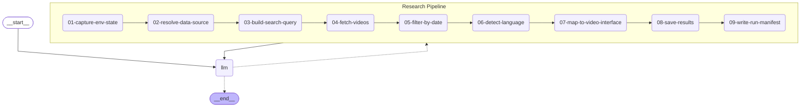
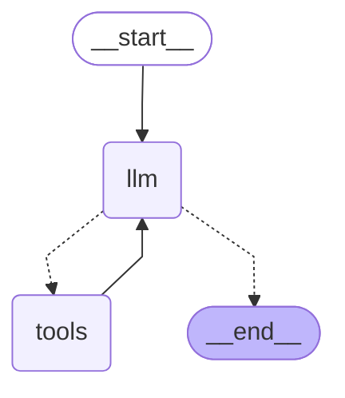
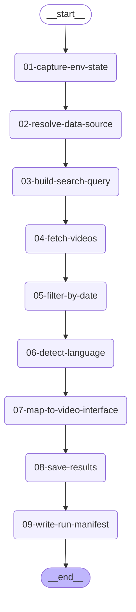

# Graph Visualizations

## Unified View (Agent + Research Pipeline)

```mermaid
%%{init: {'flowchart': {'curve': 'linear'}}}%%
graph TD;
	__start__([__start__]):::first
	llm(llm)
	__end__([__end__]):::last
	subgraph research_pipeline[Research Pipeline]
	01-capture-env-state(01-capture-env-state)
	02-resolve-data-source(02-resolve-data-source)
	03-build-search-query(03-build-search-query)
	04-fetch-videos(04-fetch-videos)
	05-filter-by-date(05-filter-by-date)
	06-detect-language(06-detect-language)
	07-map-to-video-interface(07-map-to-video-interface)
	08-save-results(08-save-results)
	09-write-run-manifest(09-write-run-manifest)
	01-capture-env-state --> 02-resolve-data-source;
	02-resolve-data-source --> 03-build-search-query;
	03-build-search-query --> 04-fetch-videos;
	04-fetch-videos --> 05-filter-by-date;
	05-filter-by-date --> 06-detect-language;
	06-detect-language --> 07-map-to-video-interface;
	07-map-to-video-interface --> 08-save-results;
	08-save-results --> 09-write-run-manifest;
	end
	__start__ --> llm;
	llm -.-> research_pipeline;
	research_pipeline --> llm;
	llm -.-> __end__;
	classDef default fill:#f2f0ff,line-height:1.2;
	classDef first fill-opacity:0;
	classDef last fill:#bfb6fc;
```

## YouTube Video Agent

```mermaid
%%{init: {'flowchart': {'curve': 'linear'}}}%%
graph TD;
	__start__([<p>__start__</p>]):::first
	llm(llm)
	tools(tools)
	__end__([<p>__end__</p>]):::last
	__start__ --> llm;
	tools --> llm;
	llm -.-> tools;
	llm -.-> __end__;
	classDef default fill:#f2f0ff,line-height:1.2;
	classDef first fill-opacity:0;
	classDef last fill:#bfb6fc;

```

## Research Graph

```mermaid
%%{init: {'flowchart': {'curve': 'linear'}}}%%
graph TD;
	__start__([<p>__start__</p>]):::first
	01-capture-env-state(01-capture-env-state)
	02-resolve-data-source(02-resolve-data-source)
	03-build-search-query(03-build-search-query)
	04-fetch-videos(04-fetch-videos)
	05-filter-by-date(05-filter-by-date)
	06-detect-language(06-detect-language)
	07-map-to-video-interface(07-map-to-video-interface)
	08-save-results(08-save-results)
	09-write-run-manifest(09-write-run-manifest)
	__end__([<p>__end__</p>]):::last
	01-capture-env-state --> 02-resolve-data-source;
	02-resolve-data-source --> 03-build-search-query;
	03-build-search-query --> 04-fetch-videos;
	04-fetch-videos --> 05-filter-by-date;
	05-filter-by-date --> 06-detect-language;
	06-detect-language --> 07-map-to-video-interface;
	07-map-to-video-interface --> 08-save-results;
	08-save-results --> 09-write-run-manifest;
	09-write-run-manifest --> __end__;
	__start__ --> 01-capture-env-state;
	classDef default fill:#f2f0ff,line-height:1.2;
	classDef first fill-opacity:0;
	classDef last fill:#bfb6fc;

```